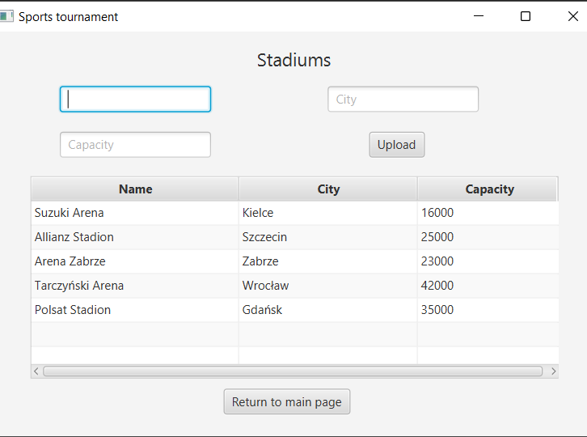

# Simple PostgreSQL and JavaFX project that contains information about sports tournament.
App shows content of each table and enables to add new records. Relations between each tables are shown below:


You can run this app by double-clicking the Project_DB1.jar file or by executing:
```
java -jar Project_DB1.jar
```
in Project-DB1\out\artifacts\Project_DB1_jar directiory.

## Example screenshots:

Main menu:


All records from stadium table:




View that presents each club's total income:


## Note:
Inserted record will be shown after you restart the app or if you come back to memu and then move to specific table.
